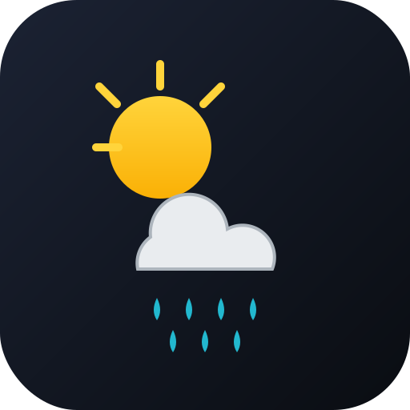

> [🇬🇧 English](README.md) | 🇩🇪 Deutsch

<p align="center">
  
</p>

# HMIP HCU Plugin: Open-Meteo Wetter

📦 **[hmip-plugin-weather-1.1.0.tar.gz herunterladen](https://github.com/fabiorenner-hub/hmip-hcu-webweather/releases/latest/download/hmip-plugin-weather-1.1.0.tar.gz)** — Installation in HCUweb über *Entwicklermodus → Plugins → Aus Datei installieren*.

GitHub: <https://github.com/fabiorenner-hub/hmip-hcu-webweather>

Ein Homematic IP HCU-Plugin, das Wetterdaten von
[Open-Meteo](https://open-meteo.com/) abruft und als `CLIMATE_SENSOR`-Geräte
in der Homematic IP App bereitstellt.

## Spenden

Wenn dir dieses Plugin hilft, freue ich mich über eine kleine Spende — sie hilft
mir, weitere HCU-Plugins zu bauen und zu pflegen.

<form action="https://www.paypal.com/donate" method="post" target="_top"><input type="hidden" name="hosted_button_id" value="JPZRATUUHRT5C" /><input type="image" src="https://www.paypalobjects.com/de_DE/DE/i/btn/btn_donate_SM.gif" border="0" name="submit" title="PayPal - The safer, easier way to pay online!" alt="Spenden mit dem PayPal-Button" /></form>

## Geräte in der HMIP-App

Bis zu fünf virtuelle `CLIMATE_SENSOR`-Geräte, getrennt nach Zeitraum
(jetzt, heute, morgen, jeweils Hoch- und Tieftemperatur).

## Auf der HCU installieren

1. `hmip-plugin-weather-<version>.tar.gz` aus den
   [Releases](https://github.com/fabiorenner-hub/hmip-hcu-webweather/releases) holen.
2. In HCUweb *Entwicklermodus → Plugins → Hochladen* öffnen und die Datei auswählen.
3. Konfiguration unter *Plugins → Open-Meteo Wetter → Konfigurieren*.

## Selbst bauen

```bash
./build.sh    # Linux/macOS
# oder
./build.ps1   # Windows
```

## Herausgeber

Herausgegeben von **Fabio Renner**.

## Lizenz

Apache-2.0
